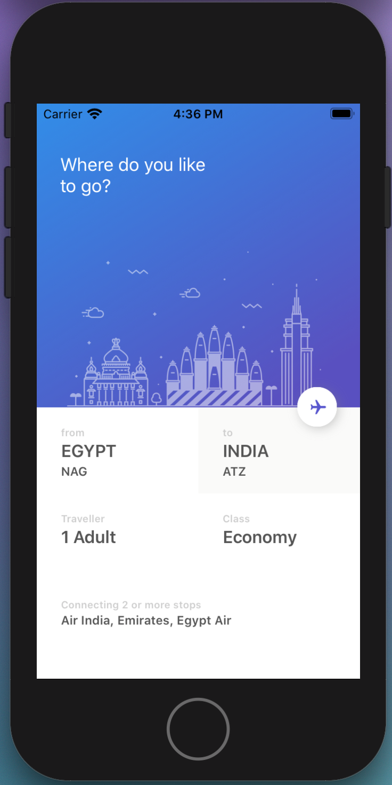
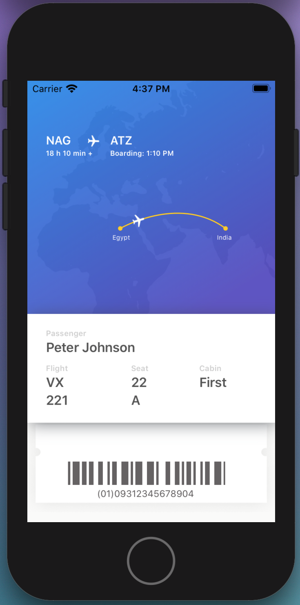

## FlightsApp
 
 > Реализация небольшой части пользовательского интерфейса - "электронный билет на самолет". 
 Верстка кодом. Работа с анимацией CAShapeLayer, CALayer, UIBezierPath
 
 
  
 
 <video>
  <source src="Simulator_SE_animation.mp4">
 </video>
